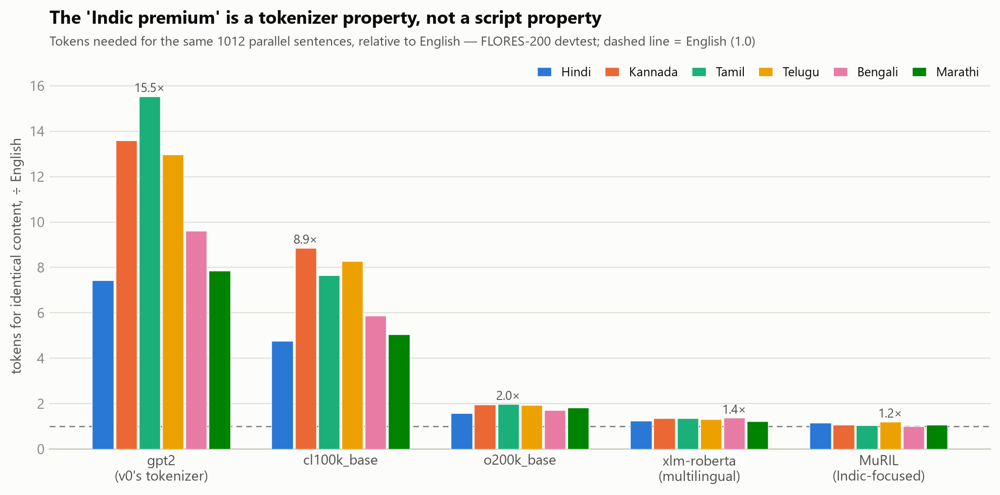
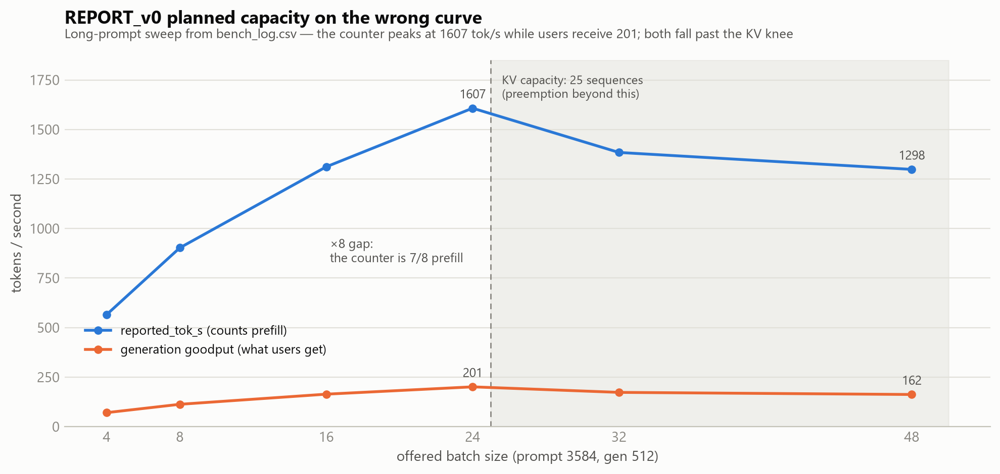

# Tokenizer & Serving Findings (v1) — corrected replacement for REPORT_v0

*Status: audited. Every figure regenerates from scripts in this repo; run
`python verify.py` to re-derive and assert all headline numbers (50 checks).
Audit trail with per-claim evidence: `partA/audit/findings.md`, `partB/capacity.md`.*

## Executive summary

1. **The Indic cost premium is real, larger than v0 said, and self-inflicted.** On
   identical content, v0's gpt2 tokenizer spends **7.4×** the tokens for Hindi
   (v0 said ~6×) and **7.9-15.5×** for Marathi, Bengali, Telugu, Kannada and
   Tamil — which v0 never measured.
2. **It is a tokenizer property, not a script property.** An Indic-focused
   vocabulary (MuRIL-class) serves the same six languages at **1.0-1.2×** English;
   v0's "any tokenizer will struggle, no further measurement needed" is falsified.
3. **v0's serving section misread its own counter.** `reported_tok_s` counts
   prefill; real generation goodput at the stable long-context peak is **201
   tok/s per L4**, not 1607, and batch 48 *degrades* to 162 tok/s — the promised
   3200 is off by **20×**.
4. **The GPU's long-context ceiling is 25 concurrent 4k sequences** (KV cache:
   112 KiB/token). This single number, derived from the model spec, predicts every
   utilization and preemption value in the load-test log exactly.
5. **Cost and capacity couple through the tokenizer.** At gpt2's 7.4× premium,
   one L4 that sustains ~25 concurrent English long-context sessions sustains
   **~3** content-equivalent Hindi sessions — **but note an inconsistency inside
   v0's own materials**: the serving spec lists a 128k vocabulary, which cannot
   be gpt2 (50k), so the *production* premium is unmeasured until FLM-4B's actual
   tokenizer is run through `partA/fertility_v1.py` (at cl100k-scale premiums the
   figure would be ~5 sessions; see §4). What holds under **every** tokenizer
   measured (minimum premium 1.16× > 4096/3584): a 3584-token English prompt's
   content **cannot fit in Hindi at all** inside the 4096-token window.

## 1. Tokenizer cost by language

Tokens per identical content (1012 parallel FLORES-200 sentences), ÷ English.
Sampling 95% CIs are within ±1.3% of every value (worst 1.28%, cl100k/Telugu);
`partA/results/results.md` has the full grid including per-word/grapheme/byte
views and UNK-rate integrity checks (max 0.38%, MuRIL/Telugu; others ≤0.02%).

| tokenizer | hin | kan | tam | tel | ben | mar |
|---|---|---|---|---|---|---|
| gpt2 (v0's tokenizer) | 7.42 | 13.59 | 15.54 | 12.97 | 9.61 | 7.86 |
| cl100k_base | 4.77 | 8.86 | 7.64 | 8.29 | 5.88 | 5.06 |
| o200k_base | 1.57 | 1.97 | 1.98 | 1.93 | 1.71 | 1.82 |
| xlm-roberta (multilingual) | 1.25 | 1.35 | 1.35 | 1.32 | 1.37 | 1.22 |
| MuRIL (Indic-focused) | **1.16** | **1.07** | **1.06** | **1.20** | **1.00** | **1.06** |

**What changed vs v0.** v0's "5.89×" came from a denominator (tokens per
whitespace word) that mis-ranks languages (−15% Hindi, +36% Kannada vs the
content-constant truth), plus a lowercasing bug and two smaller code bugs. The
corrected metric — tokens for the same content — is the number cost actually
scales with. v0's root-cause claim is dead: the premium moves 7.4× → 1.16×
(Hindi) with the script held constant and only the tokenizer changed.

**Romanized traffic (measured; direction depends on tokenizer generation and
language).** Chat-style romanized Hindi costs **2.25×** on gpt2 (vs 7.42×
native) — but on an o200k-class vocab romanization is *worse* than native **for
Hindi** (1.87× vs 1.57×), and for Marathi and Bengali; it is a within-CI tie for
Kannada and flips *cheaper* for Telugu (1.84× vs 1.93×). Tamil's romanized
figure carries a measured transliteration artifact (invented aspirates): its
honest value is a range, 2.37-3.09× on gpt2. The effective premium on production
traffic therefore depends on script mix per tokenizer generation — a dashboard
quantity, not a constant (`partA/audit/romanization.py`).

## 2. Serving throughput and capacity

| corrected quantity | value | how derived |
|---|---|---|
| KV cache per token | 112 KiB (114,688 B) | 2·28 layers·8 KV heads·128 dim·2 B |
| long-context concurrency ceiling | **25** sequences (25.7) | 12.08 GB KV budget ÷ 448 MiB/seq; predicts all 13 log rows (preemptions exactly: 7=32−25, 23=48−25) |
| generation goodput, prompt 3584 | **201 tok/s** peak at batch 24 | by definition (gen·n/wall); corroborated independently by the latency columns (steady decode n/itl ≈ 250 tok/s over the decode phase) and the roofline below |
| generation goodput, prompt 512 | 755 tok/s at batch 64 | 16,384 gen tokens / 21.68 s |
| batch 48 today | 162 tok/s (**not** 3200) | preemption thrash past the ceiling |
| decode regime | memory-bound ~38× over | one 65% MBU bandwidth model fits all 13 ITLs within ±2.8% |

**Operating envelope (replaces v0 §2's recommendation):** cap long-context
admission at **24 concurrent sequences** per L4 (predicted for offered load 48:
wall −19%, goodput +24%, zero preemptions); plan capacity on **~200 tok/s** per
L4 for 3.5k-prompt traffic and ~750 tok/s for short-prompt; *longer prompts
reduce goodput* — do not encourage context stuffing. Headroom option: **fp8 KV
cache** doubles the ceiling to ~51 sequences (arithmetic-certain) and, on the
same bandwidth model, supports batch 48 at today's batch-24 ITL (~2× decode
throughput) — contingent on a quality evaluation, and the ITL half of the
prediction additionally assumes the 65% MBU transfers to fp8-KV kernels
(dequantization overhead can make realized gains sub-proportional).

## 3. Recommendations

1. **Route Indic traffic to an Indic-aware tokenizer/model.** v0's direction
   survives; its magnitude was wrong in our favor — the saving is ~6× (Hindi) to
   ~15× (Tamil) versus v0's tokenizer, not "budget 6× more".
2. **Budget per target stack, not per language folklore**: ≈1.0-1.2× English on an
   Indic-aware route; 5-16× only for traffic that stays on a general English-
   centric vocabulary (exact figure per recommendation 6). Note the reverse
   trade: multilingual vocabularies price English ~2-13% higher.
3. **Fix the benchmark harness** to report prefill and generation throughput
   separately; capacity planning uses goodput only.
4. **Deploy the concurrency cap (24)** now; evaluate fp8 KV for the 2× headroom.
5. **Stand up the monitor before the budget is signed**: weekly tokens-per-request
   by detected language *and script*, normalized by UTF-8 bytes of user content —
   with per-language expected values **anchored in byte space at launch** (from
   `results.csv` tok_per_byte: e.g. gpt2 hin 2.91×, ben 3.64× English), since
   byte-normalized premiums differ from content parity by each script's
   bytes-per-content. Trigger on >20% drift of the live value from its anchor
   over time. `vllm:num_preemptions_total` > 0 at steady state invalidates the
   capacity plan the same way.
6. **Measure the production tokenizer before final routing splits.** The serving
   spec's 128k vocab is incompatible with gpt2 — run FLM-4B's actual tokenizer
   (and any routing-candidate's) through `partA/fertility_v1.py` on scrubbed
   real traffic; one afternoon, and it resolves the §4 open question.

## 4. Known limits of this analysis

**The "current stack" premium is bracketed, not measured.** v0 benchmarked with
gpt2, and this report corrects v0 on its own tokenizer; but the serving spec
(`bench/model_spec.md`) lists vocab = 128k, which gpt2 is not. Vocabulary size
alone does not determine Indic fertility (allocation matters), so until
recommendation 6 runs, the production premium is unknown — the cl100k row
(4.8-8.9×) is a plausible-scale illustration, not a bound. Parity is measured on
formal translated wiki prose; conversational, code-mixed production traffic will
differ (domain shift, not sampling noise, is the real error bar — hence
recommendation 5). Cross-tokenizer token counts are capability comparisons, not
a price list: per-token cost differs across model families. MuRIL is an encoder
vocabulary — evidence for what an Indic-focused vocab achieves, not a drop-in
serving tokenizer. The fp8-KV and concurrency-cap predictions are falsifiable
forecasts stated before the rerun, with the counters that would confirm or kill
them named in `partB/capacity.md` §B4.
